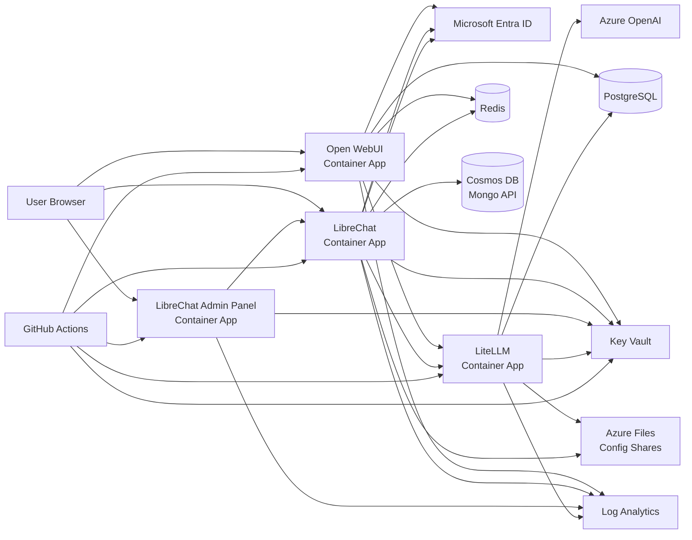

# 01 - Architecture

This repository deploys a self-hosted chat platform on Azure. `Open WebUI` and optional `LibreChat` are user-facing applications. `LiteLLM` is the central gateway for model access, spend tracking, virtual keys, and budgets.

## System Diagram

## Main Components

- `Microsoft Entra ID` authenticates users for Open WebUI and LibreChat.
- `Open WebUI` is the primary chat UI. It stores state in PostgreSQL and calls LiteLLM with a shared LiteLLM virtual key.
- `LibreChat` is an optional second chat UI. It stores state in Cosmos DB for MongoDB API and also calls LiteLLM with the shared virtual key.
- `LibreChat Admin Panel` is a separate UI. It does not own data directly; it calls LibreChat `/api/admin/*` endpoints.
- `LiteLLM` is the only component that calls Azure OpenAI. It stores keys, spend logs, customers, and budgets in PostgreSQL.
- `Key Vault` stores all runtime secrets. Container Apps read secrets through a user-assigned managed identity.
- `Azure Files` stores `litellm_config.yaml` and `librechat.yaml` so config changes can be uploaded during deployment.

## Runtime Flow

1. A user signs in to Open WebUI or LibreChat with Entra ID.
2. The frontend sends chat completions to LiteLLM using the LiteLLM service key.
3. The frontend also forwards user headers such as `X-LiteLLM-User-Email`.
4. LiteLLM maps the email header to a `customer`, applies budget rules, logs spend, and routes the call to Azure OpenAI.
5. LiteLLM returns the model response to the frontend.

## LibreChat Admin Flow

The admin panel is separate from LibreChat, but LibreChat is still the authority. The admin panel starts admin SSO through LibreChat’s `/api/admin/oauth/*` endpoints, then calls LibreChat `/api/admin/*` APIs after authentication. A user must be an admin in LibreChat, either through the Entra `admin` role claim, `role: "ADMIN"` in Mongo, or an `access:admin` grant.

## Customer Spend Model

Open WebUI and LibreChat both forward LiteLLM headers. LiteLLM is configured to treat `x-litellm-user-email` as the `customer` dimension and `x-litellm-user-id` as an `internal_user` dimension. This is what makes the same person show up as one customer when both frontends send the same email.

## Deployment Layers

The repository has two Bicep layers:

- `bicep/infra/main.bicep` creates the user-assigned managed identity and Azure OpenAI resources. Deploy this manually first because later resources grant permissions to the identity.
- `bicep/apps/main.bicep` deploys the application platform: Container Apps, PostgreSQL, Redis, Key Vault, config shares, LiteLLM, Open WebUI, and optional LibreChat.
